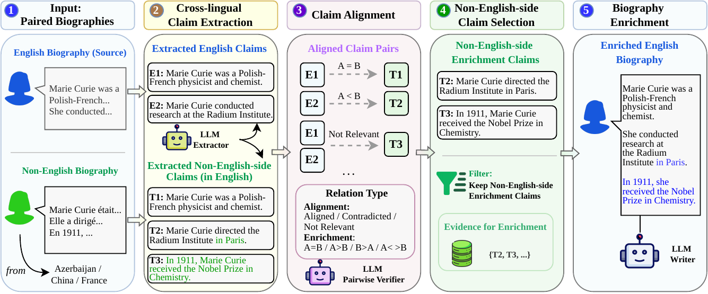
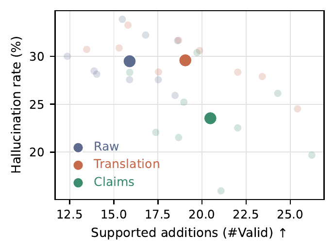
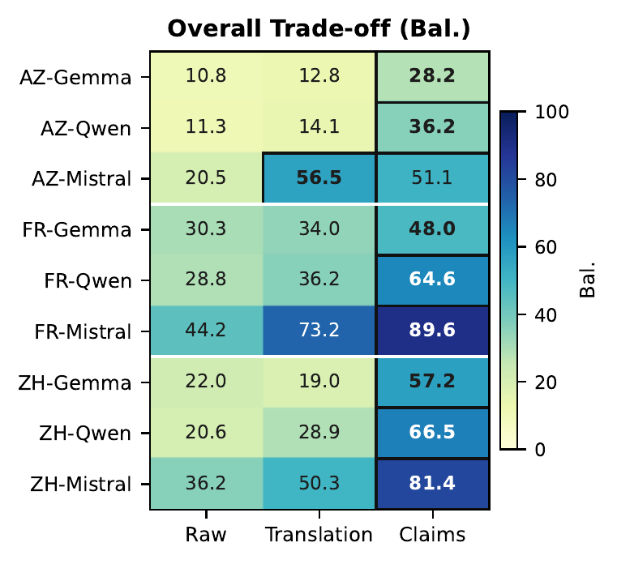

<div align="center">
<h1>🌐 Cross-lingual Biography Enrichment via Claim Extraction and Alignment</h1>
</div>

<p align="center">
  <strong>Yifei Song · Ziyang Chen · Emil Sayilov · Claire Gardent</strong><br>
  <strong>EMNLP 2026 Main Conference</strong>
</p>

<p align="center">
  <a href="https://arxiv.org/abs/2608.23390" target="_blank"></a>
  
</p>

## Framework

<p align="center">
  
</p>

The repository covers the two experimental stages of this framework:

1. **Claim-pair alignment** — classifying claim pairs as equivalent, directional entailment, partial overlap, contradiction, or unrelated.
2. **Biography enrichment** — selecting enrichment evidence, generating enriched biographies with three evidence strategies, and evaluating information gain and hallucination risk.

## Key Results

<table>
  <tr>
    <th width="50%">Supported additions and hallucination risk</th>
    <th width="50%">Overall enrichment trade-off</th>
  </tr>
  <tr>
    <td align="center"></td>
    <td align="center"></td>
  </tr>
  <tr>
    <td valign="top">Claim-based evidence moves the enrichment models toward more supported additions and a lower hallucination rate than raw or translation-based evidence.</td>
    <td valign="top">Claim-based enrichment obtains the strongest balanced score in eight of the nine language–generator settings.</td>
  </tr>
</table>

## Datasets

> [!NOTE]
> The datasets are not included in this repository due to their size. Before running the code, download the `datasets/` directory from [Google Drive](https://drive.google.com/drive/folders/1cPmK9LJWY1tO9-cF1oSlM2pQivpcAbll?usp=sharing) and place it in the repository root. The shared folder also contains intermediate datasets and experimental results.

| Path | Description |
| --- | --- |
| `datasets/CLAW-4L.jsonl` | 300 paired English and non-English Wikipedia biographies for biography enrichment. |
| `datasets/CLAW_4L_RC.jsonl` | 600 reviewed English claim pairs for fine-grained relation classification. |
| `datasets/pool_300_en_claims_gpt_5_1.jsonl` | Claims extracted from the English biographies in CLAW-4L. |
| `datasets/pool_300_target_claims_gpt_5_1.jsonl` | English-normalized claims extracted from the paired non-English biographies. |
| `datasets/claim_enrich/` | Post-enrichment claims and before/after similarity candidates for the three enrichment methods. |

CLAW-4L-RC contains six relation labels:

| Label | Relation between claims A and B |
| --- | --- |
| `A=B` | A and B express the same information. |
| `A>B` | A contains all information in B and adds more detail. |
| `B>A` | B contains all information in A and adds more detail. |
| `A<>B` | A and B overlap, but each contains unique information. |
| `Contradicted` | A and B contain incompatible information. |
| `Not relevant` | A and B do not describe the same fact. |

## Repository layout

```text
cross_lingual_biography_enrichment/
├── alignment_eval/  # Claim-pair relation classification and baselines
├── enrich_exp/      # Claim selection, enrichment, and evaluation
├── datasets/        # CLAW-4L data and enrichment inputs
├── prompts/         # Claim-alignment prompt templates
└── images/          # Figures used in this README
```

Run all commands from the repository root. Detailed instructions are provided in:

- [`alignment_eval/README.md`](alignment_eval/README.md) for claim-pair alignment and baseline evaluation.
- [`enrich_exp/README.md`](enrich_exp/README.md) for claim selection, biography enrichment, and evaluation.

## Citation

If you find our work useful, please consider citing our paper:

```bibtex
@misc{song2026crosslingualbiographyenrichmentclaim,
  title         = {Cross-lingual Biography Enrichment via Claim Extraction and Alignment},
  author        = {Yifei Song and Ziyang Chen and Emil Sayilov and Claire Gardent},
  year          = {2026},
  eprint        = {2608.23390},
  archivePrefix = {arXiv},
  primaryClass  = {cs.CL},
  url           = {https://arxiv.org/abs/2608.23390}
}
```
